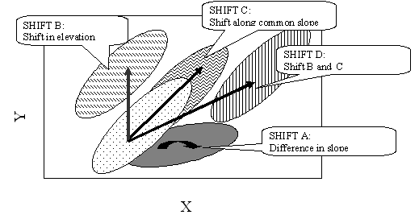

SMATR - Standardised Major Axis Tests & Routines
============================



## What is SMATR?

SMATR is a freely-available program used for fitting bivariate lines to data and for making inferences about such lines. A line can be fitted using standardised major axis (SMA), major axis (MA) or ordinary least squares regression (OLS) techniques. The routines available in SMATR allow you to:

* fit lines to groups of data using a SMA, MA or OLS fit
* construct exact confidence intervals about slope and intercept and compare these parameters to hypothesised values
* test for a common slope or elevation among lines fitted to several groups
* test for a shift along a common axis among lines fitted to several groups
* fit lines forced through the origin, appropriate for phylogenetic analyses
incorporate measurement error into parameter estimates

For background, details about the statistics, and validation of these techniques see

Warton, DI, IJ Wright, DS Falster, and M Westoby (2006) Bivariate line-fitting methods for allometry. Biological Reviews 81(2):259-291. doi :[10.1017/S1464793106007007](http://doi.org/10.1017/S1464793106007007)

## Citation

When using this package, please cite either:

Falster, D.S., Warton, D.I. & Wright, I.J. (2003) SMATR: Standardised major axis tests and routines, ver 2.0. http://www.bio.mq.edu.au/ecology/SMATR/.

To date smatr has been [used in over 250 publications](http://scholar.google.com.au/scholar?oi=bibs&hl=en&cites=5039792263257287713,9182054857820256278).

## Download and installation

The users guide can be downloaded [here](https://github.com/dfalster/smatr/releases/download/v2.0/SMATR_users_guide.pdf).

### Pre-compiled binaries

You can download pre-compiled version of smatr for mac and windows [here](https://github.com/dfalster/smatr/releases/tag/v2.0).

Note, the windows binary was compiled on windows XP and I do not know how well it will perform on newer operating systems.

### Compiling SMATR

To compile SMATR you will need an C++ compiler and ver 1.8 (or newer)
of the GSL ([GNU Scientific Library](http://www.gnu.org/software/gsl/)) installed.
After unpacking the distribution and installing GSL you can build the program by typing,

```
make
```

Please see the programs' homepage http://www.bio.mq.edu.au/ecology/smatr/
if you have any troubles.

## Support

SMATR is no longer being developed or supported. I suggest you checkout [smatr  package for R](http://cran.r-project.org/web/packages/smatr/index.html) which is still being developed and is much more functional than this program, e.g. also includes plotting. For more information see:

Warton, D.I., Duursma, R.A., Falster, D.S. & Taskinen, S. (2012) smatr 3– an R package for estimation and inference about allometric lines. Methods in Ecology and Evolution, 3, 257–259. doi: [10.1111/j.2041-210X.2011.00153.x](http://doi.org/10.1111/j.2041-210X.2011.00153.x).

For those who insist on using the standalone application, you are referred to:

- Warton et al 2006 for background on the techniques,
- the user's guide for information on how to use the program.

If you cannot find the answer to your question here, consult the links below. If you cannot find an answer here, or think you have found a bug, please post an issue [here](https://github.com/dfalster/smatr/issues).

### Version history

**Version 2.0 released Nov 13 2006**

Changes compared to version 1.0

* Major Axis and OLS routines added
* Confidence interval and one-sample test of elevation added
* Confidence interval about common slope and intercept calculated by inversion (if appropriate) , and comparison to hypothesised value included
* Natural log- transformation added
* Wald statistic for testing for common intercept and shift along the common axis added and F-statistic from version 1 removed
* Can enter capitals or lower case in menus

Differences to R version:

* Re-sampling is used for common slope test, where the R version draws from chi-squared distribution
* The standalone program removes groups less than a minimum size. In the R version the minimum size is fixed at n=2

### Trouble loading data or program crashes

1. **The data won’t load after I press L in menu 1**. The problem is the program cannot locate the data file (input.txt) and so is not progressing to the next menu. Check that:
	1. The program file (smatr.exe) is in the same folder as the data file
	2. Make sure the file has the default name (input.txt) OR that you enter a new name at the first menu (option i)
2. **The program crashes after I press L in the second menu**. There is some problem with the format of the data file. Make sure your file is a tab-delimited text file. In particular, check
	1. that all columns in all rows are present. Sometimes Excel omits the cell altogether if you have a blank cell in the far-right-column. To resolve this problem make a new variable or rearrange variables such that the right-hand column is complete.
	2. Check that black cells are entirely empty, or indicated a single space only.
	3. Check numbers are NOT saved used scientific notation (e.g. 3.2EXP-2).
		4. Remove any excess lines at the end of the file
3. **Trouble on MAC or linux**. SMATR has been compiled for mac and runs smoothly. However you may encounter three problems:
	a. Running the program: To run SMATR on a mac you can either open a terminal window and run the program from the command line, or double click on the program. With the latter you may have trouble opening your data file. This is because the double clicking sets the users home directory as the default path. Therefore you need to:
		(a) move you data files to your home directory (e.g. /Users/dfalster/), or (b) enter the relative path name as input filename (e.g. /project/data/input.txt), or
		(c) open a terminal window and run the program by typing ./smatr.
	b. Loading data files: You may also encounter a problem loading a data file since Macs and PCs use different formats for new line characters. The distributed version uses the PC default. You can convert a text file from mac to PC format by typing tr '\r' '\r\n' <mac.txt> dos.txt at the command line in terminal window. A version with mac default is also being prepared.
	c. Confidence intervals for large n: For large sample sizes (n>250) , the GSL library returns an error when calculating confidence intervals. If this concerns you, please send me an email. I am doing my best to resolve this ASAP.

## Conceptual Issues

1. **Why don’t the confidence intervals overlap zero?**
	An SMA slope is calculated as the ratio of the standard deviation in Y to standard deviation in X. Logically this can never be zero and the default slope for random data (no relationship between X & Y) with similar variance in X and Y is 1. The slope differs from 1 when the data is stretched more along one axis than the other. This means that you can record slopes significantly different to 0, even when the data aren't significantly correlated (not the case for OLS).
2. **There's only a weak relationship in my data, why are the confidence intervals about the predicted slope so tight?**
	An SMA reflects the nature of a relationship between two variables, while an r2 reflects the strength of the relationship. These are two independent properties characterising the relationship between two variables. Narrow confidence intervals are possible, even when r 2 is low, with sufficient sampling effort (i.e. large n). With a large sample size you have increased certainty about both the strength of the relationship (r2 - even if it's low you are sure about it) and the nature of the relationship (i.e. slope, intercept).
3. **Why do I get different confidence intervals in other programs?**
	SMATR calculates confidence intervals by inversion. Many other programs use an approximation by taking the confidence envelope for ordinary linear regression and applying it to the SMA slope. This will usually lead to wider intervals.
4. **If I have two groups with slopes of different direction, why doesn't the common slope lie between them?**
	The MA/SMA common slope tests do not distinguish between major and minor axes. In the case of SMA, -b and b are treated as the same thing (hence the sign of the slope is ignored), and in the case of MA, -1/b and b (perpendicular to each other) are treated as the same thing. An SMA slope is calculated by taking the ratio of sum of squares and multiplying by the sign (ie. +/-) of the XY covariance (details given in appendix). In estimating a common slope, the test doesn't distinguish between positive and negative slopes because all "sums of squares" are positive. Thus it is assumed all slopes are of similar sign (ie. all positive, all negative). So your estimated common slopes DO lie between the two slopes, but between the absolute values rather than the actual values of the positive and negative slope. But, if you have groups with slopes of different sign they are so clearly heterogeneous that a statistical test is not necessary. Reporting a common slope is also meaningless where there is significant heterogeneity, so a good estimate is not required. Where the slopes are more similar, the program allows you to test statistically for this.
5. **Why do I get the same results when comparing my data to slope of b and –b?**
	The one (and multi) sample slope tests do not distinguish between positive and negative slope values. In general this quirky property shouldn't lead to many problems since your intuition should tell you that a positive slope is obviously different to a hypothesised negative slope and a statistical test is unnecessary (or that several groups with slope of opposite sign clearly don't have a common slope).
6. **How can I plot confidence intervals for the SMA/MA line?**
	We currently do not have a good method for this. One approach would be to construct a joint confidence region for all elevation and slope possibilities. A second possibility to calculate an equal frequency ellipse for the cloud of data. This is the ellipse which includes 95% of all points.
